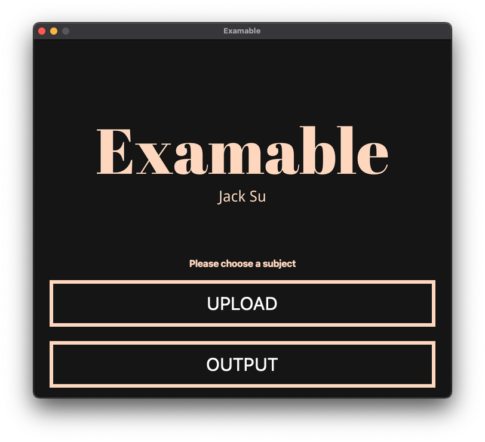

# Examable

This software is designed to search for past paper questions and answers using OCR. Currently in its prototype stage, it still has several unresolved issues. The search algorithm indexes each page individually, resulting in relatively low efficiency.

# Examable
